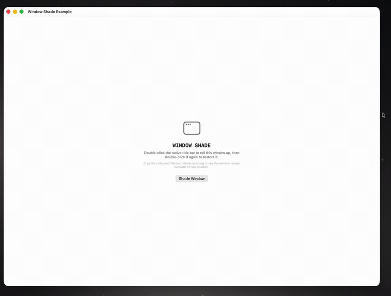

# macOSWindowShade

This repository contains two related products:

- `WindowShadeExample/` is the macOS SwiftUI reference app.
- `Packages/WindowShade/` is the reusable Swift package.

`WindowShade` brings the classic “roll up to the title bar” interaction to
modern macOS windows while retaining the native title bar and traffic-light
controls. Double-click the title bar to shade or restore the window. A shaded
window stays draggable, and restoring it opens the original window beneath its
new location.

## Demo



## Requirements

- macOS 14 or later
- Swift 6.2 or later

## WindowShade package

Add `Packages/WindowShade` as a local package dependency and link the
`WindowShade` product to your macOS app target.

Wrap the content of the window and retain a controller in SwiftUI state:

```swift
import SwiftUI
import WindowShade

struct ContentView: View {
    @State private var shadeController = WindowShadeController()

    var body: some View {
        WindowShadeContainer(controller: shadeController) {
            VStack {
                Text("My window content")

                Button("Shade Window") {
                    shadeController.toggleShade()
                }
            }
            .frame(minWidth: 500, minHeight: 300)
        }
    }
}
```

`WindowShadeContainer` attaches the controller to the containing `NSWindow` and
removes the content's height while shaded. Use `setShaded(_:)` when you need an
explicit state instead of a toggle. AppKit clients can call `attachWindow(_:)`
directly.

## Reference app

Open `WindowShadeExample.xcodeproj`, select the `WindowShadeExample` scheme,
and run it. The app links `Packages/WindowShade` as a local package dependency.

## Verification

Run package tests from the repository root:

```sh
swift test --package-path Packages/WindowShade
```

Build the reference app from the repository root:

```sh
xcodebuild -project WindowShadeExample.xcodeproj \
    -scheme WindowShadeExample \
    -destination 'platform=macOS' \
    build
```

Because the package manifest is nested to keep the reference app and package
cleanly separated, this combined repository is intended for local package use.
Publishing `WindowShade` as a remote Swift package requires a repository or tag
whose root contains the package manifest.
